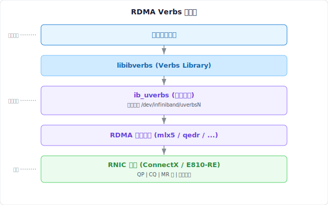

import Callout from "@components/post/Callout.astro";
import Figure from "@components/post/Figure.astro";

## 什么是 RDMA

xxxxxxxxxx #include C

- **低延迟**：通常端到端延迟在 1-3 微秒范围内
- **低 CPU 开销**：数据传输不需要 CPU 参与拷贝

RDMA 通过 **RNIC（RDMA-capable NIC）** 硬件实现，常见实现包括：

- InfiniBand
- RoCE（RDMA over Converged Ethernet）
- iWARP



## Verbs API

Verbs 是 RDMA 编程的标准接口，类似于套接字 API。核心 verbs 可分为以下几类：

### 上下文管理

```c
struct ibv_context *ibv_open_device(struct ibv_device *device);
int ibv_close_device(struct ibv_context *context);
int ibv_query_device(struct ibv_context *context, struct ibv_device_attr *attr);
```

### Protection Domain

Protection Domain（PD）是 RDMA 资源隔离的基本单位。一个 PD 内的资源可以互相访问，跨 PD 的访问被硬件阻止。

```c
struct ibv_pd *ibv_alloc_pd(struct ibv_context *context);
int ibv_dealloc_pd(struct ibv_pd *pd);
```

### Memory Region

Memory Region（MR）用于向 RNIC 注册一块内存区域，确保：

1. 用户空间的虚拟内存不被换出
2. RNIC 获得虚拟地址到物理地址的映射
3. 设置本地和远程访问权限

```c
struct ibv_mr *ibv_reg_mr(struct ibv_pd *pd, void *addr,
                          size_t length, int access);
int ibv_dereg_mr(struct ibv_mr *mr);
```

<Callout type="tip">
  RDMA 的零拷贝依赖于 Memory Region 的预注册。注册 MR 是一个代价较高的操作（需要 pin
  住物理页面），应当尽可能复用已注册的 MR。
</Callout>

### Completion Queue

Completion Queue（CQ）用于通知用户工作请求的完成状态。每个 QP 的发送和接收完成事件可以指向同一个或不同的 CQ。

```c
struct ibv_cq *ibv_create_cq(struct ibv_context *ctx, int cqe,
                              void *cq_context,
                              struct ibv_comp_channel *channel,
                              int comp_vector);
```

### Queue Pair

Queue Pair（QP）是 RDMA 通信的核心。每个 QP 包含：

- **Send Queue（SQ）**：存放发送工作请求
- **Receive Queue（RQ）**：存放接收工作请求

```c
struct ibv_qp *ibv_create_qp(struct ibv_pd *pd,
                              struct ibv_qp_init_attr *qp_init_attr);
int ibv_modify_qp(struct ibv_qp *qp, struct ibv_qp_attr *attr,
                   int attr_mask);
```

QP 的状态机如下：

```text title="QP 状态转移 (terminal)"
RESET ──► INIT ──► RTR ──► RTS
                    ▲        │
                    └────────┘
                    (错误恢复)

INIT:  端口信息已配置
RTR:   Ready to Receive
RTS:   Ready to Send (可进行数据传输)
```

<Figure
  src="./rdma-stack.svg"
  alt="RDMA 协议栈层次结构"
  caption="RDMA Verbs 位于用户空间与内核空间之间，通过 ib_uverbs 接口与 RNIC 硬件通信。"
/>

## 数据路径概述

一次典型的 RDMA SEND 操作遵循以下流程：

1. **发送方**提交一个 `ibv_post_send()` 工作请求到 QP 的 SQ
2. RNIC 硬件从 QP 的 SQ 取出 Work Request
3. RNIC 从注册的 MR 中读取数据
4. 数据经网络传输到远端 RNIC
5. **接收方**的 RNIC 将数据写入预先注册的 MR
6. RNIC 在发送方和接收方的 CQ 中各生成一个 Work Completion

<Callout type="note">
  RDMA WRITE 和 RDMA READ 属于单边操作（one-sided），只需要远端预先注册好 MR 并提供 rkey，不需要远端
  CPU 参与数据路径。
</Callout>

## 基础示例程序

以下代码展示了创建一个基本 QP 所需的步骤：

```c title="rdma_setup.c" {4-8, 14-18}
#include <infiniband/verbs.h>
#include <stdio.h>
#include <stdlib.h>

static struct ibv_context *setup_rdma(const char *dev_name) {
    struct ibv_device **dev_list = ibv_get_device_list(NULL);
    if (!dev_list) {
        perror("ibv_get_device_list");
        return NULL;
    }

    struct ibv_context *ctx = NULL;
    for (int i = 0; dev_list[i]; i++) {
        if (strcmp(ibv_get_device_name(dev_list[i]), dev_name) == 0) {
            ctx = ibv_open_device(dev_list[i]);
            break;
        }
    }

    ibv_free_device_list(dev_list);

    if (!ctx) {
        fprintf(stderr, "Device %s not found\n", dev_name);
    }

    return ctx;
}
```

<Callout type="warning">
  创建完 QP 后，必须通过 `ibv_modify_qp` 将状态从 RESET 逐步迁移到 RTS
  才能进行数据传输。跳过状态转换会导致 `ibv_post_send()` 失败。
</Callout>

<Callout type="danger">
  忘记 deregister MR 或 dealloc PD 会导致内存泄漏和 RNIC 资源耗尽。请在生产代码中始终使用 RAII
  风格或 `goto cleanup` 模式确保资源释放。
</Callout>

## 总结

RDMA Verbs 是构建高性能网络应用的基础。核心概念包括 PD（资源隔离）、MR（内存注册）、CQ（完成通知）和 QP（数据传输）。理解这些组件及其生命周期管理是写出正确 RDMA 程序的前提。
