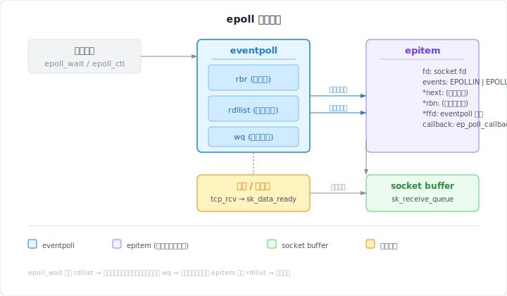

## epoll 解决了什么问题

在 epoll 出现之前，Linux 主要有两种 I/O 多路复用机制：`select` 和 `poll`。它们的共同问题在于：

1. **每次调用都需要传递完整的文件描述符集合给内核**，调用返回后还要遍历整个集合才能找到就绪的描述符。
2. **O(n) 时间复杂度**：随着并发连接数增加，性能线性下降。
3. **文件描述符数量限制**：`select` 默认最多支持 1024 个（可重编译内核调整）。

epoll 通过将"注册"和"等待"两个操作分离，从根本上解决了这些问题。

## 核心数据结构

epoll 在内核中的核心数据结构包括：

- **红黑树（rbtree）**：存储所有注册的文件描述符
- **就绪链表（rdllist）**：存储已经就绪的文件描述符
- **等待队列（wait queue）**：将调用进程挂起，等待事件通知



## 三个核心系统调用

### epoll_create1

```c
int epoll_create1(int flags);
```

内核分配一个 `eventpoll` 结构体，初始化红黑树和就绪链表。返回的 fd 指向这个内核对象。

### epoll_ctl

```c
int epoll_ctl(int epfd, int op, int fd, struct epoll_event *event);
```

支持三种操作：

- `EPOLL_CTL_ADD`：将 fd 加入红黑树，并在该 fd 的等待队列中注册回调
- `EPOLL_CTL_MOD`：修改已注册 fd 的事件类型
- `EPOLL_CTL_DEL`：从红黑树中删除 fd，移除回调

关键的 **回调函数** `ep_poll_callback` 会在 fd 就绪时被调用，将对应的 `epitem` 从红黑树移动到就绪链表。

### epoll_wait

```c
int epoll_wait(int epfd, struct epoll_event *events, int maxevents, int timeout);
```

内核检查就绪链表是否非空：

- 非空：立即将就绪事件拷贝到用户空间并返回
- 空：将当前进程挂起到等待队列，设置超时

下面是一个完整的 TCP echo 服务端示例：

```c title="server.c"
#include <sys/epoll.h>
#include <sys/socket.h>
#include <netinet/in.h>
#include <unistd.h>
#include <stdio.h>
#include <string.h>
#include <fcntl.h>

#define MAX_EVENTS 64

static void set_nonblocking(int fd) {
    int flags = fcntl(fd, F_GETFL, 0);
    fcntl(fd, F_SETFL, flags | O_NONBLOCK);
}

int main() {
    int listen_fd = socket(AF_INET, SOCK_STREAM, 0);
    set_nonblocking(listen_fd);

    struct sockaddr_in addr = {
        .sin_family = AF_INET,
        .sin_port = htons(8080),
        .sin_addr.s_addr = INADDR_ANY,
    };
    bind(listen_fd, (struct sockaddr *)&addr, sizeof(addr));
    listen(listen_fd, SOMAXCONN);

    int epfd = epoll_create1(0);
    struct epoll_event ev = {.events = EPOLLIN, .data.fd = listen_fd};
    epoll_ctl(epfd, EPOLL_CTL_ADD, listen_fd, &ev);

    struct epoll_event events[MAX_EVENTS];

    for (;;) {
        int nfds = epoll_wait(epfd, events, MAX_EVENTS, -1);
        for (int i = 0; i < nfds; i++) {
            int fd = events[i].data.fd;

            if (fd == listen_fd) {
                int conn = accept(listen_fd, NULL, NULL);
                set_nonblocking(conn);
                ev.events = EPOLLIN | EPOLLET;  // Edge-triggered
                ev.data.fd = conn;
                epoll_ctl(epfd, EPOLL_CTL_ADD, conn, &ev);
            } else {
                char buf[4096];
                ssize_t n = read(fd, buf, sizeof(buf));
                if (n > 0) {
                    write(fd, buf, n);
                } else {
                    close(fd);
                }
            }
        }
    }
}
```

## LT 与 ET 模式

这是 epoll 中最容易引起困惑的两个模式。

| 模式                 | 行为                                       | 适用场景                   |
| -------------------- | ------------------------------------------ | -------------------------- |
| Level-Triggered (LT) | 只要缓冲区有数据，每次 `epoll_wait` 都返回 | 简单、安全，类似 `poll`    |
| Edge-Triggered (ET)  | 只在状态变化时返回一次                     | 高性能，必须配合非阻塞 I/O |

```c
// ET 模式使用 EPOLLONESHOT 避免惊群
ev.events = EPOLLIN | EPOLLET | EPOLLONESHOT;
```

## 常见误区

1. **"epoll 总是比 poll 快"**：在连接数较少（如 < 10）时，poll 可能更快，因为 epoll 的系统调用开销更大。
2. **"ET 模式一定比 LT 快"**：ET 模式的性能优势主要体现在减少系统调用上，但编写正确的 ET 代码更难。
3. **"红黑树是性能瓶颈"**：红黑树操作是 O(log n)，在实际负载中很少成为瓶颈。真正的开销通常来自锁竞争和缓存失效。

## 内核实现要点

以下是一个典型场景的内核执行路径（简化版）：

```txt title="epoll 事件处理路径 (terminal)"
用户进程                  内核空间
────────────────────────────────────────
epoll_wait() ──────────► 检查 rdllist
                         │
                         ├─ 非空：拷贝事件，返回
                         └─  空：加入 wait queue，挂起进程

网卡中断 ───────────────► 协议栈处理
                         │
                         ▼
                      tcp_rcv_established()
                         │
                         ▼
                      sk_data_ready()
                         │
                         ▼
                      sock_def_readable()
                         │
                         ▼
                      ep_poll_callback()  ← 注册的回调
                         │
                         ▼
                      将 epitem 加入 rdllist
                         │
                         ▼
                      唤醒等待队列上的进程
                         │
                         ▼
epoll_wait() 返回 ◄─── 用户进程被唤醒
```

## 修改后的回调逻辑

在优化过程中，我们可能会修改回调的锁处理方式：

```diff
--- a/eventpoll.c
+++ b/eventpoll.c
@@ -450,7 +450,9 @@ static int ep_poll_callback(wait_queue_entry_t *wait, unsigned mode, int sync, void *key)
-    spin_lock_irqsave(&ep->lock, flags);
+    // Use trylock to avoid contention in hot path
+    if (!spin_trylock_irqsave(&ep->lock, flags))
+        return 0;  // Let the caller handle it
     if (!ep_is_linked(&epi->rdllink))
         list_add_tail(&epi->rdllink, &ep->rdllist);
     spin_unlock_irqrestore(&ep->lock, flags);
```

## 总结

epoll 的精妙之处在于通过红黑树和回调机制，将对大量 fd 的监控从 O(n) 查找优化为 O(1) 事件通知。理解其内部实现有助于在高并发场景中做出正确的设计决策。

### 参考资料

- Linux 内核源码 `fs/eventpoll.c`
- `man 7 epoll`
- [The Implementation of epoll](https://idea.popcount.org/2017-02-20-epoll-is-fundamentally-broken-part-1/)
